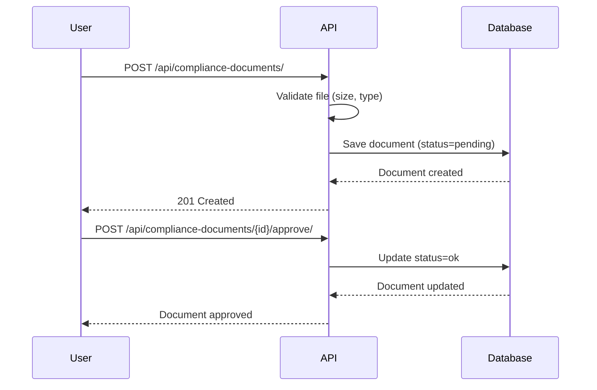
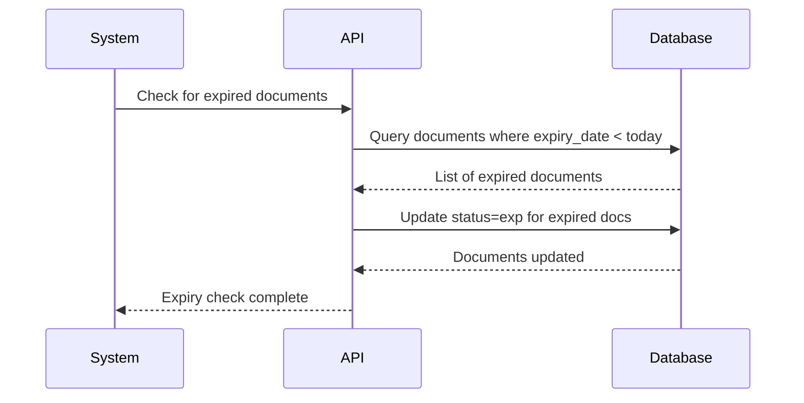
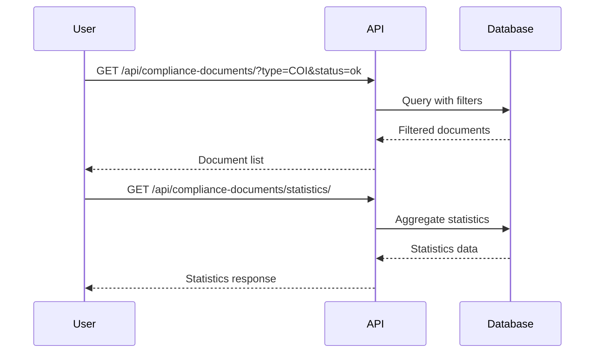

# Compliance & Accreditation Document Management API

Complete API documentation for managing compliance and accreditation documents for syndicates, based on Screen 37 design.

## Table of Contents
1. [Overview](#overview)
2. [Authentication](#authentication)
3. [Document Model](#document-model)
4. [API Endpoints](#api-endpoints)
5. [Request/Response Examples](#requestresponse-examples)
6. [Error Handling](#error-handling)
7. [Workflows](#workflows)

---

## Overview

The Compliance & Accreditation API enables syndicates to:
- Upload compliance documents (COI, Tax, Attestation, etc.)
- Track document status (OK, Expired, Missing, Pending, Rejected)
- Manage jurisdictional compliance
- Monitor document expiry dates
- Review and approve/reject documents
- Get compliance statistics

### Base URL
```
/api/compliance-documents/
```

### Supported File Types
- PDF (`.pdf`)
- DOCX (`.docx`)
- JPEG (`.jpg`, `.jpeg`)
- PNG (`.png`)

### Maximum File Size
25 MB per document

---

## Authentication

All endpoints require authentication via JWT token:

```http
Authorization: Bearer <your_jwt_token>
```

### Permissions
- **Syndicate Owner**: Full access to all compliance documents
- **Team Manager**: Full access with `can_manage_settings` permission
- **Other Roles**: Access based on team permissions

---

## Document Model

### ComplianceDocument Fields

| Field | Type | Description |
|-------|------|-------------|
| `id` | Integer | Unique document identifier |
| `syndicate` | ForeignKey | Reference to syndicate profile |
| `document_name` | String | Display name of document |
| `document_type` | Choice | Document type (COI, Tax, Attest., etc.) |
| `jurisdiction` | Choice | Jurisdiction code (US (NY), EU (DE), etc.) |
| `file` | File | Uploaded document file |
| `original_filename` | String | Original uploaded filename |
| `file_size` | Integer | File size in bytes |
| `file_size_mb` | Float | File size in MB (computed) |
| `mime_type` | String | MIME type of file |
| `status` | Choice | Document status (pending, ok, exp, missing, rejected) |
| `review_notes` | Text | Notes from reviewer |
| `reviewed_by` | ForeignKey | User who reviewed document |
| `reviewed_at` | DateTime | Review timestamp |
| `expiry_date` | Date | Document expiration date |
| `is_expired` | Boolean | Whether document is expired (computed) |
| `uploaded_by` | ForeignKey | User who uploaded document |
| `uploaded_at` | DateTime | Upload timestamp |
| `updated_at` | DateTime | Last update timestamp |

### Document Type Choices

```python
DOCUMENT_TYPE_CHOICES = [
    ('COI', 'Certificate of Incorporation (COI)'),
    ('Tax', 'Tax Document'),
    ('Attest.', 'Attestation Document'),
    ('Bank', 'Bank Statement'),
    ('Identity', 'Identity Document'),
    ('Address', 'Proof of Address'),
    ('Other', 'Other Compliance Document'),
]
```

### Jurisdiction Choices

```python
JURISDICTION_CHOICES = [
    ('US (NY)', 'United States (New York)'),
    ('US (TX)', 'United States (Texas)'),
    ('US (CA)', 'United States (California)'),
    ('US (DE)', 'United States (Delaware)'),
    ('EU (DE)', 'European Union (Germany)'),
    ('EU (FR)', 'European Union (France)'),
    ('EU (UK)', 'European Union (United Kingdom)'),
    ('Asia (SG)', 'Asia (Singapore)'),
    ('Asia (HK)', 'Asia (Hong Kong)'),
    ('Other', 'Other Jurisdiction'),
]
```

### Status Choices

```python
STATUS_CHOICES = [
    ('pending', 'Pending Review'),
    ('ok', 'OK'),
    ('exp', 'Expired'),
    ('missing', 'Missing'),
    ('rejected', 'Rejected'),
]
```

---

## API Endpoints

### 1. List All Documents

**Endpoint:** `GET /api/compliance-documents/`

**Description:** Retrieve all compliance documents for the authenticated syndicate.

**Query Parameters:**
- `type` (optional): Filter by document type (COI, Tax, Attest., etc.)
- `jurisdiction` (optional): Filter by jurisdiction
- `status` (optional): Filter by status (pending, ok, exp, missing, rejected)
- `expiry` (optional): Filter by expiry status
  - `expired`: Documents that are expired
  - `expiring_soon`: Documents expiring within 30 days

**Response:**
```json
{
    "success": true,
    "count": 5,
    "documents": [
        {
            "id": 1,
            "document_name": "Certificate of Incorporation",
            "document_type": "COI",
            "document_type_display": "Certificate of Incorporation (COI)",
            "jurisdiction": "US (NY)",
            "status": "ok",
            "status_display": "OK",
            "file_size_mb": 2.5,
            "expiry_date": "2025-12-31",
            "is_expired": false,
            "uploaded_by_name": "John Doe",
            "uploaded_at": "2024-01-15T10:30:00Z"
        }
    ]
}
```

---

### 2. Upload New Document

**Endpoint:** `POST /api/compliance-documents/`

**Description:** Upload a new compliance document.

**Request Body (multipart/form-data):**
```
document_name: "Certificate of Incorporation"
document_type: "COI"
jurisdiction: "US (NY)"
file: [binary file data]
expiry_date: "2025-12-31" (optional)
```

**Response:**
```json
{
    "success": true,
    "message": "Document uploaded successfully",
    "document": {
        "id": 1,
        "syndicate": 1,
        "document_name": "Certificate of Incorporation",
        "document_type": "COI",
        "jurisdiction": "US (NY)",
        "file": "/media/compliance_documents/syndicate_1/coi.pdf",
        "file_url": "http://localhost:8000/media/compliance_documents/syndicate_1/coi.pdf",
        "original_filename": "coi.pdf",
        "file_size": 2621440,
        "file_size_mb": 2.5,
        "mime_type": "application/pdf",
        "status": "pending",
        "review_notes": null,
        "reviewed_by": null,
        "reviewed_by_name": null,
        "reviewed_at": null,
        "expiry_date": "2025-12-31",
        "is_expired": false,
        "uploaded_by": 1,
        "uploaded_by_name": "John Doe",
        "uploaded_at": "2024-01-15T10:30:00Z",
        "updated_at": "2024-01-15T10:30:00Z"
    }
}
```

**Validation:**
- File size must not exceed 25 MB
- File type must be pdf, docx, jpg, jpeg, or png
- All required fields must be provided

---

### 3. Get Document Details

**Endpoint:** `GET /api/compliance-documents/{id}/`

**Description:** Retrieve detailed information about a specific document.

**Response:**
```json
{
    "success": true,
    "document": {
        "id": 1,
        "syndicate": 1,
        "document_name": "Certificate of Incorporation",
        "document_type": "COI",
        "jurisdiction": "US (NY)",
        "file": "/media/compliance_documents/syndicate_1/coi.pdf",
        "file_url": "http://localhost:8000/media/compliance_documents/syndicate_1/coi.pdf",
        "original_filename": "coi.pdf",
        "file_size": 2621440,
        "file_size_mb": 2.5,
        "mime_type": "application/pdf",
        "status": "ok",
        "review_notes": "Document verified and approved",
        "reviewed_by": 2,
        "reviewed_by_name": "Jane Smith",
        "reviewed_at": "2024-01-15T14:30:00Z",
        "expiry_date": "2025-12-31",
        "is_expired": false,
        "uploaded_by": 1,
        "uploaded_by_name": "John Doe",
        "uploaded_at": "2024-01-15T10:30:00Z",
        "updated_at": "2024-01-15T14:30:00Z"
    }
}
```

---

### 4. Update Document Details

**Endpoint:** `PATCH /api/compliance-documents/{id}/`

**Description:** Update document metadata (excluding file).

**Request Body:**
```json
{
    "document_name": "Updated Certificate Name",
    "document_type": "COI",
    "jurisdiction": "US (TX)",
    "expiry_date": "2026-12-31"
}
```

**Response:**
```json
{
    "success": true,
    "message": "Document updated successfully",
    "document": {
        "id": 1,
        "document_name": "Updated Certificate Name",
        "document_type": "COI",
        "jurisdiction": "US (TX)",
        "expiry_date": "2026-12-31",
        ...
    }
}
```

**Note:** File updates are not allowed. To change a file, delete the document and upload a new one.

---

### 5. Delete Document

**Endpoint:** `DELETE /api/compliance-documents/{id}/`

**Description:** Delete a compliance document.

**Response:**
```json
{
    "success": true,
    "message": "Document \"Certificate of Incorporation\" deleted successfully"
}
```

---

### 6. Update Document Status

**Endpoint:** `POST /api/compliance-documents/{id}/update_status/`

**Description:** Update the status of a document with review notes.

**Request Body:**
```json
{
    "status": "ok",
    "review_notes": "Document verified and approved"
}
```

**Response:**
```json
{
    "success": true,
    "message": "Document status updated to OK",
    "document": {
        "id": 1,
        "status": "ok",
        "review_notes": "Document verified and approved",
        "reviewed_by": 2,
        "reviewed_by_name": "Jane Smith",
        "reviewed_at": "2024-01-15T14:30:00Z",
        ...
    }
}
```

---

### 7. Approve Document

**Endpoint:** `POST /api/compliance-documents/{id}/approve/`

**Description:** Approve a document (set status to OK).

**Request Body:** None

**Response:**
```json
{
    "success": true,
    "message": "Document approved successfully",
    "document": {
        "id": 1,
        "status": "ok",
        "reviewed_by": 2,
        "reviewed_by_name": "Jane Smith",
        "reviewed_at": "2024-01-15T14:30:00Z",
        ...
    }
}
```

---

### 8. Reject Document

**Endpoint:** `POST /api/compliance-documents/{id}/reject/`

**Description:** Reject a document with notes explaining why.

**Request Body:**
```json
{
    "notes": "Document is not clear. Please upload a higher resolution copy."
}
```

**Response:**
```json
{
    "success": true,
    "message": "Document rejected",
    "document": {
        "id": 1,
        "status": "rejected",
        "review_notes": "Document is not clear. Please upload a higher resolution copy.",
        "reviewed_by": 2,
        "reviewed_by_name": "Jane Smith",
        "reviewed_at": "2024-01-15T14:30:00Z",
        ...
    }
}
```

**Validation:** `notes` field is required.

---

### 9. Mark Document as Expired

**Endpoint:** `POST /api/compliance-documents/{id}/mark_expired/`

**Description:** Manually mark a document as expired.

**Request Body:** None

**Response:**
```json
{
    "success": true,
    "message": "Document marked as expired",
    "document": {
        "id": 1,
        "status": "exp",
        ...
    }
}
```

---

### 10. Get Compliance Statistics

**Endpoint:** `GET /api/compliance-documents/statistics/`

**Description:** Retrieve aggregated statistics about compliance documents.

**Response:**
```json
{
    "success": true,
    "statistics": {
        "total_documents": 15,
        "by_status": {
            "ok": 8,
            "pending": 3,
            "exp": 2,
            "rejected": 1,
            "missing": 1
        },
        "by_type": {
            "COI": 3,
            "Tax": 5,
            "Attest.": 4,
            "Bank": 2,
            "Other": 1
        },
        "expired": 2,
        "expiring_soon": 3
    }
}
```

---

### 11. Get Document Types

**Endpoint:** `GET /api/compliance-documents/document_types/`

**Description:** Retrieve available document type options.

**Response:**
```json
{
    "success": true,
    "document_types": [
        {"value": "COI", "label": "Certificate of Incorporation (COI)"},
        {"value": "Tax", "label": "Tax Document"},
        {"value": "Attest.", "label": "Attestation Document"},
        {"value": "Bank", "label": "Bank Statement"},
        {"value": "Identity", "label": "Identity Document"},
        {"value": "Address", "label": "Proof of Address"},
        {"value": "Other", "label": "Other Compliance Document"}
    ]
}
```

---

### 12. Get Jurisdictions

**Endpoint:** `GET /api/compliance-documents/jurisdictions/`

**Description:** Retrieve available jurisdiction options.

**Response:**
```json
{
    "success": true,
    "jurisdictions": [
        {"value": "US (NY)", "label": "United States (New York)"},
        {"value": "US (TX)", "label": "United States (Texas)"},
        {"value": "US (CA)", "label": "United States (California)"},
        {"value": "US (DE)", "label": "United States (Delaware)"},
        {"value": "EU (DE)", "label": "European Union (Germany)"},
        {"value": "EU (FR)", "label": "European Union (France)"},
        {"value": "EU (UK)", "label": "European Union (United Kingdom)"},
        {"value": "Asia (SG)", "label": "Asia (Singapore)"},
        {"value": "Asia (HK)", "label": "Asia (Hong Kong)"},
        {"value": "Other", "label": "Other Jurisdiction"}
    ]
}
```

---

### 13. Get Status Options

**Endpoint:** `GET /api/compliance-documents/status_options/`

**Description:** Retrieve available status options.

**Response:**
```json
{
    "success": true,
    "statuses": [
        {"value": "pending", "label": "Pending Review"},
        {"value": "ok", "label": "OK"},
        {"value": "exp", "label": "Expired"},
        {"value": "missing", "label": "Missing"},
        {"value": "rejected", "label": "Rejected"}
    ]
}
```

---

## Request/Response Examples

### Example 1: Upload COI Document

**Request:**
```bash
curl -X POST http://localhost:8000/api/compliance-documents/ \
  -H "Authorization: Bearer YOUR_JWT_TOKEN" \
  -F "document_name=Certificate of Incorporation" \
  -F "document_type=COI" \
  -F "jurisdiction=US (NY)" \
  -F "expiry_date=2025-12-31" \
  -F "file=@/path/to/coi.pdf"
```

**Response:**
```json
{
    "success": true,
    "message": "Document uploaded successfully",
    "document": {
        "id": 1,
        "document_name": "Certificate of Incorporation",
        "document_type": "COI",
        "jurisdiction": "US (NY)",
        "status": "pending",
        "file_size_mb": 2.5,
        "expiry_date": "2025-12-31",
        "uploaded_at": "2024-01-15T10:30:00Z"
    }
}
```

---

### Example 2: Filter Documents by Status

**Request:**
```bash
curl -X GET "http://localhost:8000/api/compliance-documents/?status=ok" \
  -H "Authorization: Bearer YOUR_JWT_TOKEN"
```

**Response:**
```json
{
    "success": true,
    "count": 8,
    "documents": [
        {
            "id": 1,
            "document_name": "Certificate of Incorporation",
            "status": "ok",
            "status_display": "OK",
            ...
        }
    ]
}
```

---

### Example 3: Approve Document

**Request:**
```bash
curl -X POST http://localhost:8000/api/compliance-documents/1/approve/ \
  -H "Authorization: Bearer YOUR_JWT_TOKEN"
```

**Response:**
```json
{
    "success": true,
    "message": "Document approved successfully",
    "document": {
        "id": 1,
        "status": "ok",
        "reviewed_by_name": "Jane Smith",
        "reviewed_at": "2024-01-15T14:30:00Z"
    }
}
```

---

### Example 4: Get Expired Documents

**Request:**
```bash
curl -X GET "http://localhost:8000/api/compliance-documents/?expiry=expired" \
  -H "Authorization: Bearer YOUR_JWT_TOKEN"
```

**Response:**
```json
{
    "success": true,
    "count": 2,
    "documents": [
        {
            "id": 5,
            "document_name": "Tax Document 2023",
            "status": "exp",
            "expiry_date": "2023-12-31",
            "is_expired": true
        }
    ]
}
```

---

## Error Handling

### Error Response Format

All errors follow a consistent format:

```json
{
    "success": false,
    "error": "Error message describing what went wrong"
}
```

### Common Error Codes

| HTTP Code | Description |
|-----------|-------------|
| 400 | Bad Request - Validation error or invalid data |
| 401 | Unauthorized - Missing or invalid authentication token |
| 403 | Forbidden - User doesn't have permission for this action |
| 404 | Not Found - Document doesn't exist |
| 413 | Payload Too Large - File size exceeds 25 MB |
| 500 | Internal Server Error - Server-side error |

### Error Examples

#### File Too Large

```json
{
    "success": false,
    "error": "File size cannot exceed 25MB"
}
```

#### Invalid File Type

```json
{
    "success": false,
    "error": "Unsupported file type. Allowed types: .pdf, .docx, .jpg, .jpeg, .png"
}
```

#### Missing Rejection Notes

```json
{
    "success": false,
    "error": "Rejection notes are required"
}
```

---

## Workflows

### Workflow 1: Upload and Review Document



### Workflow 2: Document Expiry Management



### Workflow 3: Filter and Export Documents



---

## Integration with Screen 37 UI

The API is designed to directly support the Figma Screen 37 interface:

### Document Upload Section
- Use `POST /api/compliance-documents/` with multipart form data
- Monitor upload with progress tracking
- Display file size, type, and validation errors

### Document Table
- Use `GET /api/compliance-documents/` to populate table
- Display columns: Document Name, Type, Jurisdiction, Status, Actions
- Status badges mapped to API status values:
  - `ok` → Green "OK" badge
  - `exp` → Red "Exp." badge
  - `pending` → Orange "Pending" badge
  - `missing` → Yellow "Missing" badge
  - `rejected` → Red "Rejected" badge

### Filter Controls
- Document Type dropdown: Use `GET /api/compliance-documents/document_types/`
- Jurisdiction dropdown: Use `GET /api/compliance-documents/jurisdictions/`
- Status filter: Use `GET /api/compliance-documents/status_options/`
- Apply filters via query parameters

### Actions
- View: `GET /api/compliance-documents/{id}/`
- Edit: `PATCH /api/compliance-documents/{id}/`
- Delete: `DELETE /api/compliance-documents/{id}/`
- Approve: `POST /api/compliance-documents/{id}/approve/`
- Reject: `POST /api/compliance-documents/{id}/reject/`

---

## Testing Checklist

- [ ] Upload document with valid file (PDF, DOCX, JPG, PNG)
- [ ] Upload document with invalid file type (should fail)
- [ ] Upload document exceeding 25 MB (should fail)
- [ ] List all documents
- [ ] Filter documents by type, jurisdiction, status
- [ ] Get document details
- [ ] Update document metadata
- [ ] Approve document
- [ ] Reject document with notes
- [ ] Mark document as expired
- [ ] Delete document
- [ ] Get compliance statistics
- [ ] Test expiry tracking (expired and expiring soon)
- [ ] Test permissions (syndicate owner vs team member)

---

## Notes

- Documents are automatically set to `pending` status upon upload
- Expiry checks are computed on-the-fly using `is_expired` property
- Files are stored in `media/compliance_documents/syndicate_{id}/` directory
- All timestamps are in UTC
- Syndicate context is automatically determined from authenticated user

---

## Support

For issues or questions about the Compliance & Accreditation API, please contact the development team or refer to the main API documentation.
